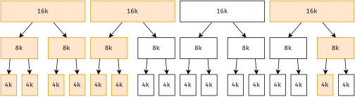
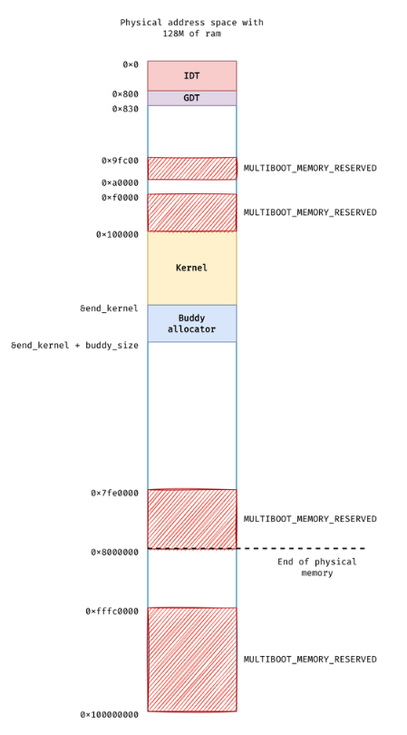
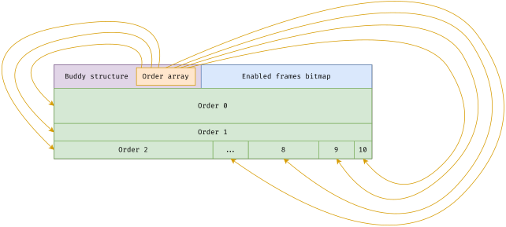
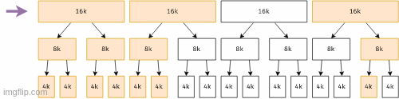

# Nulix Buddy allocator

Every kernel needs a physical memory manager, including Nulix. We choosed to implement a buddy allocator as Linux does. This document describes its internals.

## Overview

The goal of the buddy allocator is to keep several representations of the same memory space, with different orders. Each order seeing the memory as blocks twice as big as the ones from the previous order. It can be represented as a binary like this:



In this diagram, we have an address space of 64Kib. Orange cells are allocated, white ones are free. Each layer of the tree represents the **same memory space**, with different block size. To save precious space, we'll store each layer of the tree as a pointer to a bitmap, in which each bit represents a block, set to 0 if it is available, and to 1 if allocated.

We'll use 11 orders, ranging from blocks of 4Kib (first order) to blocks of 4Mib (10th order).

## Location

As we don't have any memory management system yet, we can't ask someone for memory to put the buddy allocator in. Instead, we will choose an arbitrary address, put it there, and ensure nobody uses this memory region afterward.

We decided to put it on the first unused page after the kernel. Here is the resulting physical memory layout:



## Layout

The following diagram is the in-memory layout of our buddy allocator. Individual components are described below.



- The buddy structure keeps sizes, offset and other internal stuff. It's definition can be found later in this document.
- The order array contains `NORDERS` pointers to `NORDERS` bitmaps. Eeach one represents the full address space, divided in different blocks size. Each bit of the respective bitmaps represents a block for this order.
- The enabled frames bitmap contains information of which pageframe is enabled (thus available for allocation). Each bit set to 1 represent an available page frame. Those set to 0 are disabled.

## Mechanism

### Initialization

First, we set the buddy address, aligned on the first available page after the kernel.

Then we fill the buddy structure information, by computing it's size and offsets of the different elements.

Finally we set the available memory maps regions (provided by the multiboot info structure) as enabled, except reserved areas such as the kernel, the buddy allocator itself and descriptor tables.

### Allocation

To allocate memory, we call the `kpm_alloc` function specifying a size in bytes.

The allocator will first determine which is the smaller order able to fulfill our request, e.g. if we ask for 15000 bytes, the chosen order will be the 3rd one indexing blocks of 16KiB.

Then it'll go through the bitmap for that order, searching for a free block (a bit set to 0). If one is found, the chunk structure is filled with the corresponding address and size, the area is set as allocated on order 0, and the tree is updated.

If however, no free block is found on the optimal order, the buddy allocator will search in smaller ones, until it finds some free block. If none is found, it means that there is no more available memory, and an error code is returned.

Note that if a free block is found in a smaller order than the optimal one, the resulting chunk will hold less bytes than requested. The caller will have to make another call to `kpm_alloc` to get the remaining bytes.

In the following example, we have 64KiB of physical memory, and we request an allocation of 5500 bytes. Here is the corresponding function call:
```c
kpm_alloc(&chunk, 5500);
```
And this is how the allocator works:



After this call, the `chunk` struct will look like this:
```
chunk.addr = 24576
chunk.size = 8192
```

### Deallocation

To free up memory, a previously allocated chunk must be given to the `kpm_free` function.

It will determine how much frame to free, and for each, check that the frame is enabled, in the enabled frames bitmap. If it is, the bit representing the frame will be set to 0 (free) on the first order.
When each frame has been released, the tree is updated to reflect the changes.

Note that we need to make sure the frame is enabled before freeing it because if we don't we'll be able to free disabled areas, and subsequent calls to `kpm_alloc` might return those areas.

## Strucures definition

Here is the buddy allocator structure definition:
```c
typedef uint8_t bitmap_t;

typedef struct buddy {
    size_t nframes;              // Number of pageframes in the physical memory
    size_t size;                 // Size in bytes of the buddy allocator (struct + bitmaps)
    bitmap_t *enabled_frames;    // Enabled pageframes bitmap address
    bitmap_t *orders[11];        // Array of pointers to orders bitmaps
    uint8_t pad[8];              // Unused padding bytes
} buddy_t;

typedef struct kpm_chunk {
    void *addr;                 // Base address of a memory chunk. Must be page aligned
    size_t size;                // Size in bytes of the chunk.
} kpm_chunk_t;
```

## API
```c
void kpm_init(struct multiboot_mmap_entry *mmap_entries, size_t n, size_t memsize);
void kpm_enable(void *base, size_t limit);
void kpm_disable(void *base, size_t limit);
int kpm_isenabled(void *addr);
int kpm_isalloc(void *addr);
int kpm_alloc(kpm_chunk_t *chunk, size_t size);
void kpm_free(kpm_chunk_t *chunk);
```
